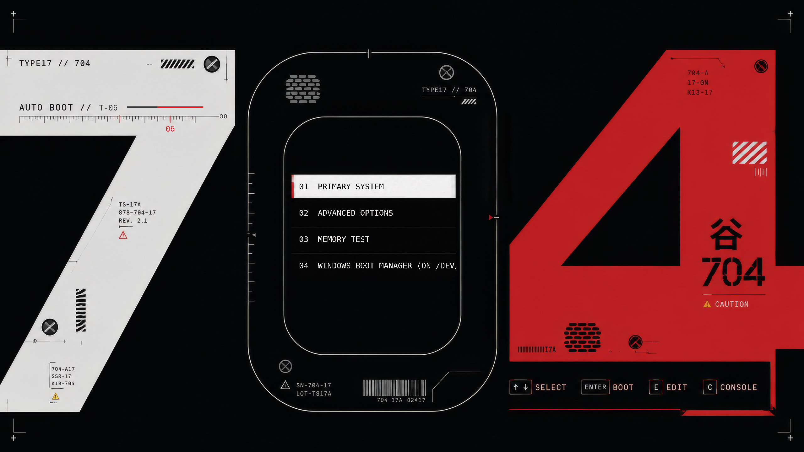
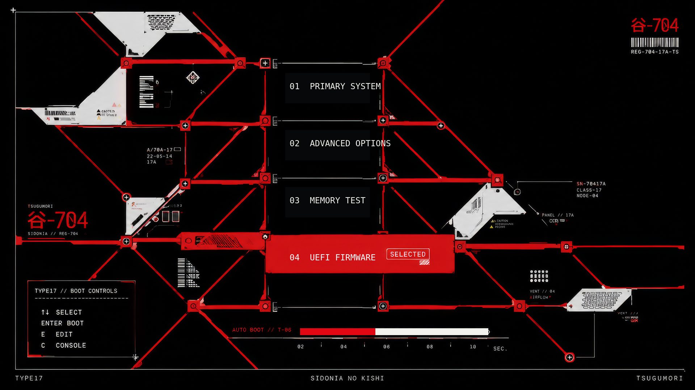
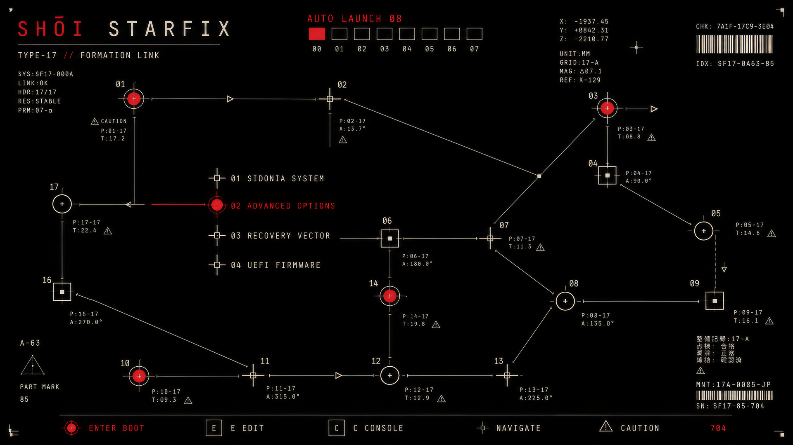
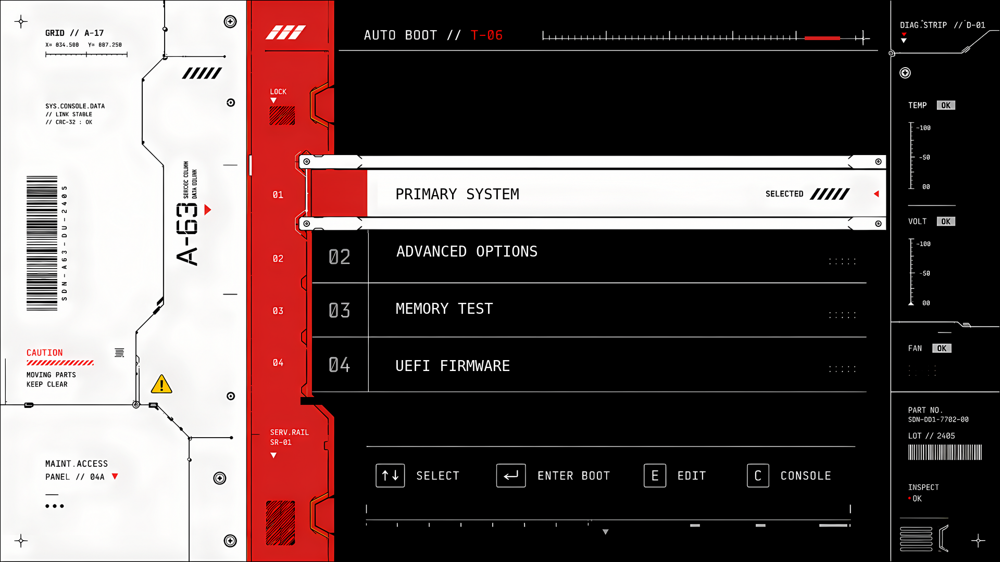

# Sidonia

Sidonia is a small collection of four sci-fi GRUB themes made to give the boot
screen the feeling of a ship interface.

## Themes

### T1 — Frame 704



### T2 — Gridline



### T3 — Starfix



### T4 — System Bay



## Install

Sidonia is designed for GNU GRUB systems that use `/etc/default/grub`.

```bash
git clone https://github.com/Aleph1-9012/Sidonia.git
cd Sidonia
sudo ./install.sh
```

The installer guides you through choosing a theme and display profile. It also
keeps a rollback copy and never runs `grub-install`.

Sidonia changes the GRUB configuration, so use it with `sudo`.

## Switch themes

Open the guided theme chooser whenever you want to switch:

```bash
sudo sidonia
```

You can also select a theme directly:

```bash
sudo sidonia set T2 1080p
```

Available display profiles:

- `720p` — 1280×720
- `1080p` — 1920×1080
- `1440p` — 2560×1440 and larger

## Restore

Undo the latest theme change:

```bash
sudo sidonia rollback
```

Remove Sidonia and restore the original GRUB appearance:

```bash
sudo sidonia uninstall
```

## More information

- [Advanced installation and troubleshooting](docs/ADVANCED.md)
- [License](LICENSE)
- [Artwork and font notices](NOTICE.md)

Sidonia is an independent project and is not affiliated with the GRUB project
or any media franchise.
