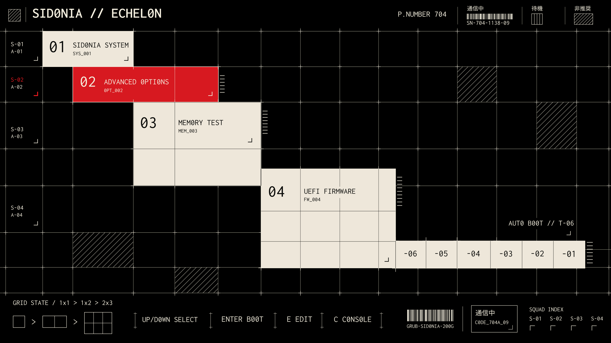

# Sidonia

Sidonia is a small collection of five sci-fi GRUB themes made to give the boot
screen the feeling of a ship interface.

## Themes

### T1 — Frame 704


### T2 — Gridline


### T3 — Starfix


### T4 — System Bay


### T5 — Echelon



Echelon fills its cards from your actual GRUB entries, using their names,
order and boot commands. It refreshes the artwork whenever `grub-mkconfig`
writes a new configuration. Escape opens the complete original menu.

## Install

Sidonia is designed for GNU GRUB systems that use `/etc/default/grub`.

```bash
git clone --depth 1 https://github.com/Aleph1-9012/Sidonia.git
cd Sidonia
sudo ./install.sh
```

The installer guides you through choosing a theme and display profile. It also
keeps a rollback copy and never runs `grub-install`.

Sidonia changes the GRUB configuration, so use it with `sudo`.

## Switch themes

Open the guided theme chooser whenever you want to switch:

```bash
sudo sidonia
```

You can also select a theme directly:

```bash
sudo sidonia set T2 1080p
```

Install and activate Echelon on a 2560×1600 display:

```bash
sudo ./install.sh T5 1440p --gfxmode 2560x1600
```

After installation, switch to it with `sudo sidonia set T5 1440p`.
It appears automatically on the next boot. No GRUB console command is needed.

Available display profiles:

- `720p` — 1280×720
- `1080p` — 1920×1080
- `1440p` — 2560×1440 and larger

The 1440p canvas stays at 2560×1440 on larger displays, with black padding.
At 2560×1600 that adds 80 pixels above and below; at 3840×2160 it adds
640 pixels on each side and 360 pixels above and below.

Echelon assembles its entry labels with Bash, `awk` and `gzip`, using the
prebuilt artwork and character library included in the download. Installing
or updating it does not require Python, Pillow or `rsvg-convert`. It supports
one to four cards. Larger menus and entries discovered only at boot use the
complete standard GRUB list. Long card titles are shortened to fit; the original
menu and entry editor keep their full names. Titles containing characters
outside the bundled fonts use the complete standard menu.

Echelon's countdown is
six seconds; an existing disabled or immediate timeout stays disabled or
immediate. Escape opens the original boot menu. If the requested graphics mode
or a required font fails, the original menu remains available in text mode.

## Restore

Undo the latest theme change:

```bash
sudo sidonia rollback
```

Remove Sidonia and restore the original GRUB appearance:

```bash
sudo sidonia uninstall
```

[](https://ko-fi.com/G3M826JKYV)

## More information

- [Editable source assets](https://github.com/Aleph1-9012/Sidonia/releases/tag/v1.0.0)
- [Advanced installation and troubleshooting](docs/ADVANCED.md)
- [License](LICENSE)
- [Artwork and font notices](NOTICE.md)
- [Echelon design sources and rebuilds](design/cascade/README.md)

Sidonia is an independent project and is not affiliated with the GRUB project
or any media franchise.
